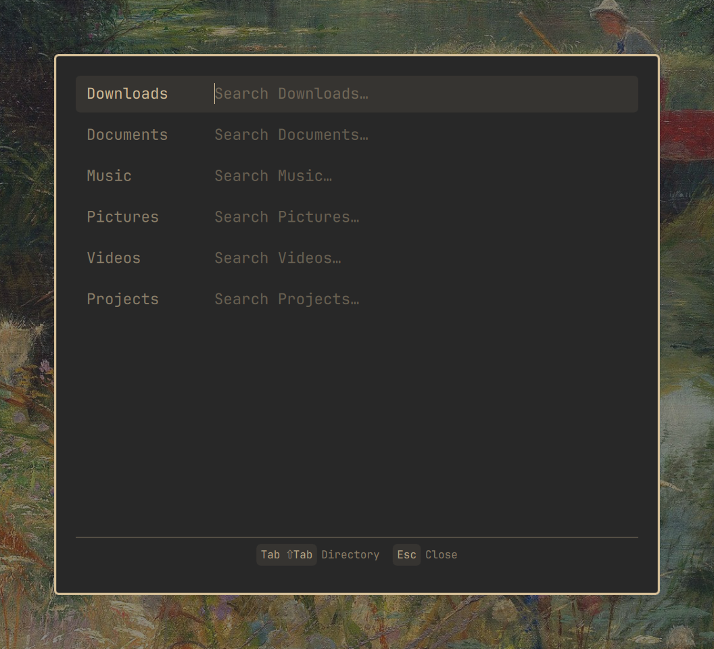
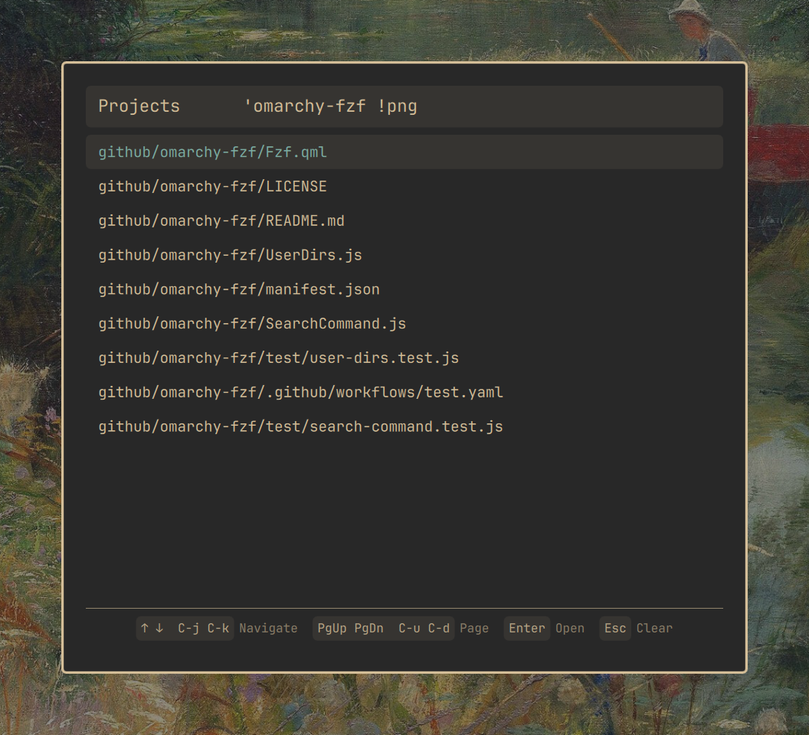

# fzf for Omarchy

A Quickshell overlay for [Omarchy](https://omarchy.org/) that fuzzy-finds
files in your XDG user directories and opens them.

The overlay reads `~/.config/user-dirs.dirs` and shows one search field per
configured directory (Downloads, Documents, Music, Pictures, …). Entries that
point at your home directory itself are skipped, since searching there would
dwarf every other directory.

As soon as you type into a field, the other fields disappear and matching
files from that directory appear below, ranked by fzf. The field stays
visible so you can keep refining the search. Selecting an entry opens the
file with `xdg-open`.

## Screenshots

Choose an XDG user directory to search:



Review fuzzy-ranked file results without leaving the keyboard:



## Requirements

- Omarchy with the Quickshell desktop shell
- [`fzf`](https://github.com/junegunn/fzf)
- [`fd`](https://github.com/sharkdp/fd)
- `xdg-open`

## Install

```bash
omarchy plugin add https://github.com/sgruendel/omarchy-fzf.git --enable
```

## Remove

```bash
omarchy plugin remove sgruendel.fzf --yes
```

## Usage

Summon the overlay through the shell:

```bash
omarchy-shell shell toggle sgruendel.fzf
```

To bind it to a key, add a line like this to `~/.config/hypr/bindings.lua`:

```lua
o.bind("XF86Search", nil, "omarchy-shell shell toggle sgruendel.fzf")
```

## Controls

- Type in a field: fuzzy-search that directory
- `Tab` / `Shift+Tab`: move between directory fields
- `Up` / `Down` or `Ctrl+K` / `Ctrl+J`: move the result selection
- `PageUp` / `PageDown` or `Ctrl+U` / `Ctrl+D`: move by ten results
- `Enter`: open the selected file with `xdg-open`
- `Escape`: clear the current search, or close the overlay when empty
- Click a result to open it; click outside the card to close the overlay

## How it works

Each keystroke is debounced (150 ms) and runs
`fd --type f --hidden --exclude .git | fzf --scheme=path --filter=<query>`
inside the directory, so results use fzf's path-oriented ranking. Hidden
files are included except `.git`; fd also respects your `.gitignore`.

## Development

Run the parser and search-pipeline tests with:

```bash
node --test
```

## License

[MIT](LICENSE)
